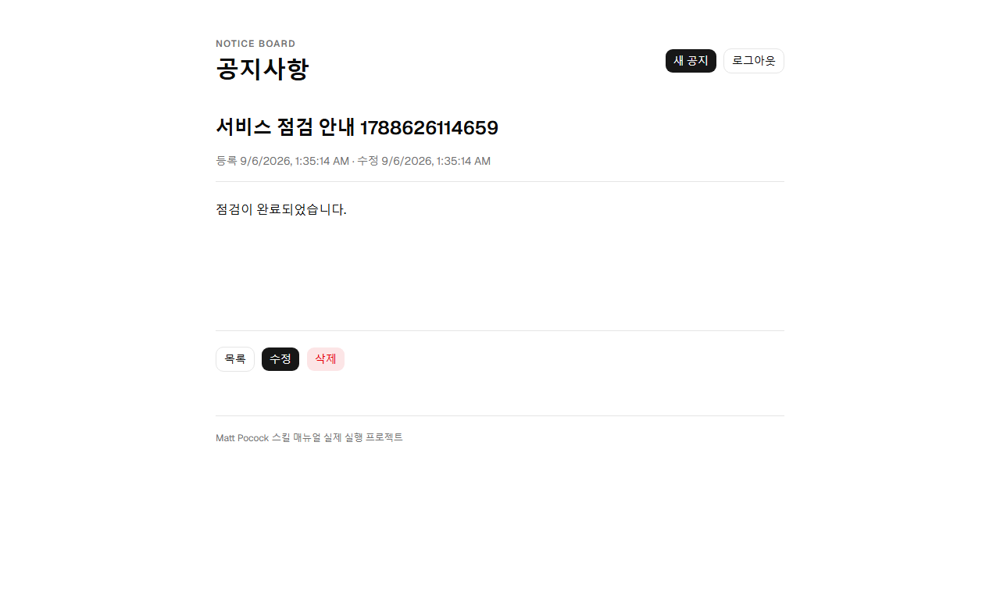

# 실제 실행 기록

[원래 튜토리얼](https://github.com/jhs512/matt-user-guide)을 빈 저장소에서 실행했습니다. 실행 시작 시 원문은 [source-tutorial.md](source-tutorial.md)에 보관했습니다.

## 어떻게 실행했나

대화창의 slash 명령을 다른 프로그램에 자동 입력한 기록이 아니라, 설치된 각 스킬의 SKILL.md 지시를 읽고 이 에이전트가 실제 도구로 수행한 기록입니다. 튜토리얼에 이미 정해진 선택은 다시 묻지 않고 사용했습니다.

| 단계 | 실제 수행 | 확인할 결과 |
|---|---|---|
| 설치 | Matt 스킬 37개, 글로벌 전체 설치, Codex·Claude Code 복사 설치 | 설치 명령 종료 코드 0 |
| `/setup-matt-pocock-skills` | 파일 이슈 관리·기본 분류·프로젝트 규칙 구성 | AGENTS.md, docs/agents |
| `/grill-with-docs` | 튜토리얼의 인증·글자 수·정렬·DB·배포 기본값을 선택하고 기술 문서·Initializr 확인 | CONTEXT.md, docs/adr |
| `/to-spec` | 요구사항·제외 범위·검사 방법 작성 | .scratch/notice-board/spec.md |
| `/to-tickets` | 읽기, 로그인·등록, 수정·삭제, CI, 배포 5개 작업 | .scratch/notice-board/issues |
| `/implement` | Spring API, React 화면, 테스트, 자동 검사 작성·실행 | backend, frontend, .github/workflows |
| `/code-review` | 최초 설계 커밋 094522c와 구현 비교, 기준·명세 두 축 검토 | review.md |

## 실행으로 발견한 문제

| 발견 | 실제 결과 | 수정 |
|---|---|---|
| 기존 Vite에 shadcn 추가 | 경로 별칭 없어서 init 실패 | Vite alias와 두 tsconfig paths 설정 후 init |
| shadcn preset 추측 | radix-nova는 유효하지 않음 | CLI에서 확인한 `--base radix --preset nova` 사용 |
| 보안이 오류 처리까지 차단 | 400·404가 보안 응답으로 변함 | ERROR dispatcher 허용, 실제 HTTP 상태 검사 |
| CORS Bean만 선언 | 브라우저는 Failed to fetch, HTTP 로그인은 성공 | SecurityFilterChain에 configurationSource 명시 연결 |
| textarea를 label로 감싸기 | 값이 있는 수정 화면에서 정확한 label 조회 실패 | htmlFor/id로 명시 연결 |
| 시간 정밀도 | 저장 직후와 DB 조회의 생성 시간이 미세하게 다름 | 저장 전 microseconds로 통일 |
| 만료 토큰을 공개 상세에 전송 | 공개 글인데 401 발생 가능 | 공개 GET에는 토큰을 보내지 않음 |
| Railway 생성 | Free plan resource provision limit exceeded | 운영 배포 완료로 표시하지 않음 |

처음 공개 목록 테스트가 실패한 뒤 구현하여 통과시키는 과정을 수행했습니다. 모든 코드를 각각 테스트부터 작성했다고 주장하지 않습니다.

## 실제로 통과한 것

- H2 메모리 DB와 실제 Spring Security를 통과하는 HTTP 검사: 공개 읽기, 오류 상태, 입력 제한, 페이지 이동, 수정 시 생성일·순서 보존, 로그인과 CRUD, 만료·변조 토큰·권한 거부, CORS.
- React 화면 검사와 TypeScript·프로덕션 빌드.
- Chromium에서 실제 H2 파일 서버를 이용한 로그인·등록·수정·새로고침·공개 조회·삭제.
- 로컬 Docker PostgreSQL 17.11 + prod 프로필: Flyway 마이그레이션, JPA validate, health 200, 실제 CRUD, 생성일 보존, 삭제 후404.

이 이미지는 HTML 시안이 아니라 E2E 테스트 중 실행 앱에서 캡처했습니다.

## 아직 완료되지 않은 것

Railway 계정은 로그인됐지만 새 프로젝트 생성이 요금제 한도로 거절됐습니다. 기존 프로젝트를 삭제하거나 요금제를 변경하지 않았습니다. 따라서 Railway 운영 PG·API 배포, 연결된 Pages 공개 사이트, 운영 자동배포는 미완료입니다. Cloudflare도 로컬 OAuth 로그인과 Actions용 API 토큰은 별개이며 저장소의 운영 Secrets는 아직 없습니다.

로컬 PostgreSQL 성공은 Railway 성공을 뜻하지 않습니다. GitHub Actions의 배포 job은 DEPLOY_ENABLED가 true이고 실제 설정을 준비한 후에만 실행됩니다.

GitHub Actions 최초 실행은 PostgreSQL health-cmd의 작은따옴표가 runner 인자 처리에서 보존되어 실패했습니다. 큰따옴표로 수정했습니다. 로컬 명령을 CI YAML로 옮길 때도 실제 runner 실행을 확인해야 한다는 사례입니다.
