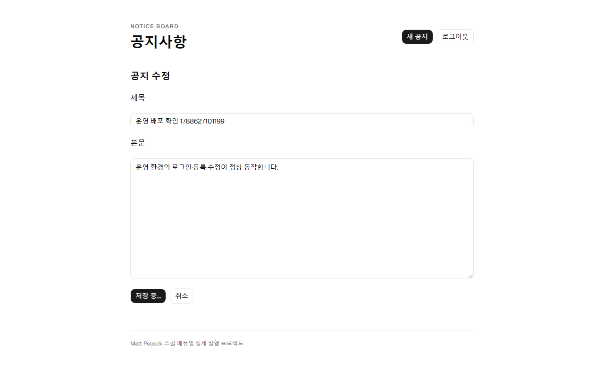

# 운영 배포 진행 기록

## 공개 주소

- 프론트: https://2nd-matt-user-guide.pages.dev
- API: https://api-production-bf95.up.railway.app
- Railway 프로젝트: 3e45eb88-a8d1-4eff-a277-82668e0e04d5
- API 서비스: fb8a1728-39b5-4ce6-a58a-0317d58b32a3
- PostgreSQL: Railway 템플릿의 PostgreSQL 18

## 인증과 계정

운영 관리자 이름은 admin입니다. 비밀번호는 무작위로 새로 만들었으며 로컬 실습 비밀번호를 재사용하지 않았습니다. 이 Windows 계정의 저장소 밖 `.config/2nd-matt-user-guide/admin.credential.xml`에 Windows 암호화로 보관했습니다. 원래 배포한 PC에서 `./scripts/show-production-login.ps1`을 실행하면 확인할 수 있습니다.

Railway에는 BCrypt 해시만 등록했습니다. JWT 서명 키도 별도 생성했습니다. DB 접속 값은 Postgres 서비스 변수를 참조합니다.

## 배포 설정

API 소스는 루트 Dockerfile, Root Directory는 저장소 루트입니다. CORS Origin은 https://2nd-matt-user-guide.pages.dev 하나를 허용합니다. API는 PORT=8080을 사용하며 /actuator/health가 DB 연결을 포함해 준비 상태를 검사합니다.

GitHub production 환경에 RAILWAY_TOKEN을 등록했습니다. Railway 프로젝트 Settings → Tokens에서 production 전용 토큰을 생성합니다. 토큰 값은 문서에 기록하지 않습니다.

DEPLOY_ENABLED=true는 검증 후 Railway 배포를 허용합니다. PAGES_DEPLOY_ENABLED는 Cloudflare API 토큰을 준비할 때 true로 바꿉니다. Pages는 최초 공개 배포와 지속적인 자동배포를 구분해 기록합니다. 로컬 Wrangler OAuth 로그인이 있다고 GitHub Actions의 인증이 생기지는 않습니다.

## 검증 증거

- [Railway 자동배포 성공](https://github.com/jhs512/2nd-matt-user-guide/actions/runs/33979027438): be387359eb2b7f5f7b3c2f6c9978b1e421023699 배포 후 API revision 일치와 DB health 확인.
- 운영 API에서 공지 생성·조회·수정·삭제를 확인했습니다. 브라우저에서도 동일 작업과 새로고침 후 로그아웃을 확인했고 검증용 공지는 삭제했습니다.
- 아래 화면은 실제 Pages에서 운영 API를 호출한 검증 중 캡처입니다.

Pages의 최초 공개 배포는 로컬 Wrangler로 수행했습니다. GitHub Actions의 Pages 단계는 현재 건너뛰며, API 토큰 등록 후 별도 검증해야 합니다.
